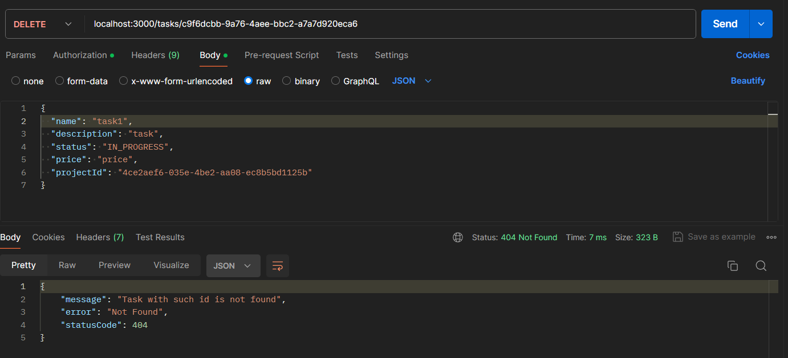

# Тестування працездатності системи

Тестування сервісу проводилося за допомогою Postman.

## Запуск сервера

    

## POST /tasks

    

## PATCH /tasks/:id

    

## GET /tasks

    

## GET /tasks/:id

    

## DELETE /tasks/:id

    

## EXCEPTION: Task was not found

    

